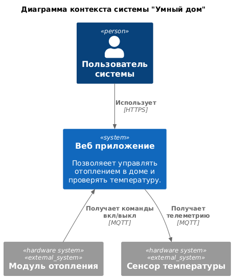
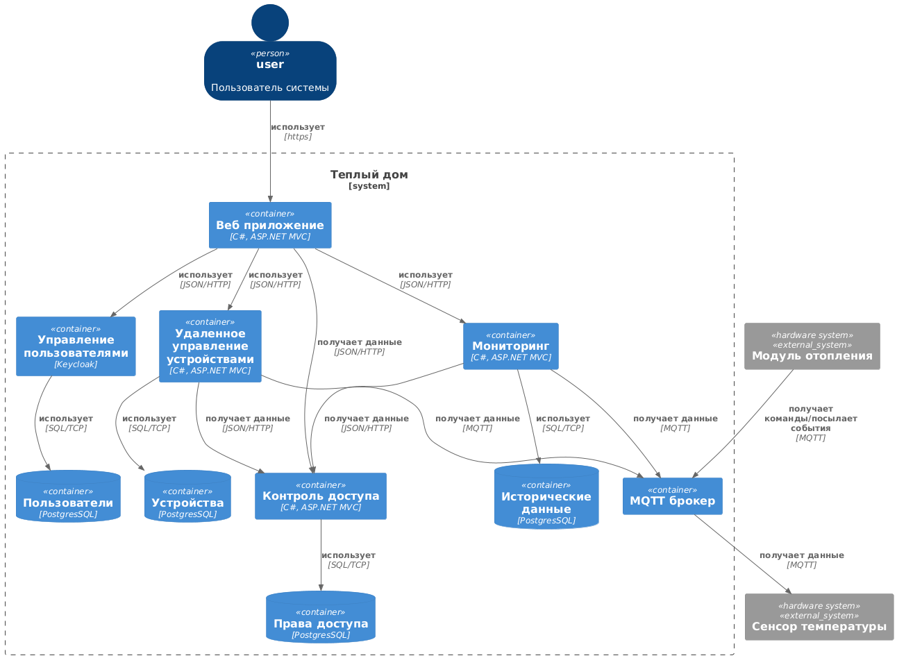
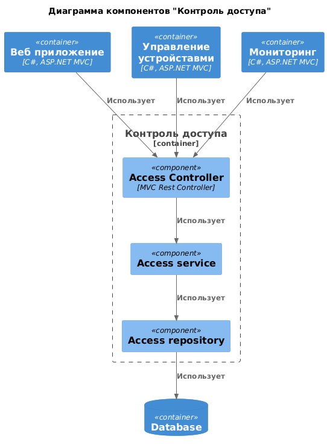
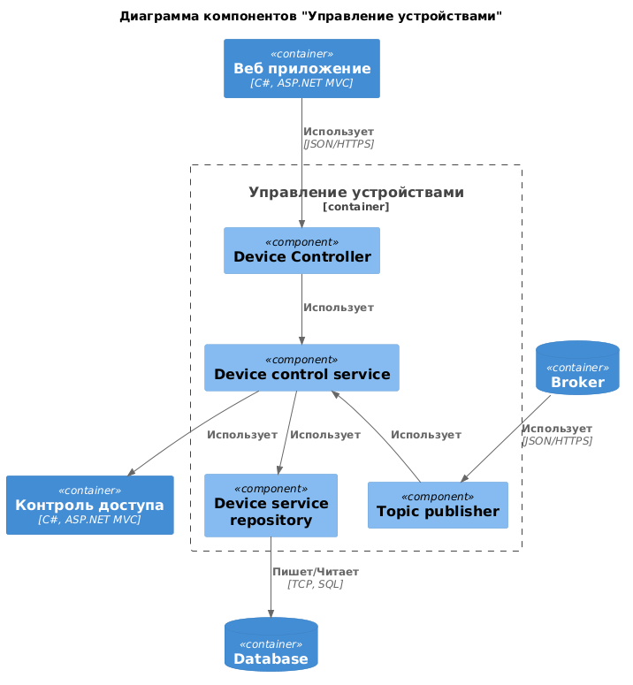
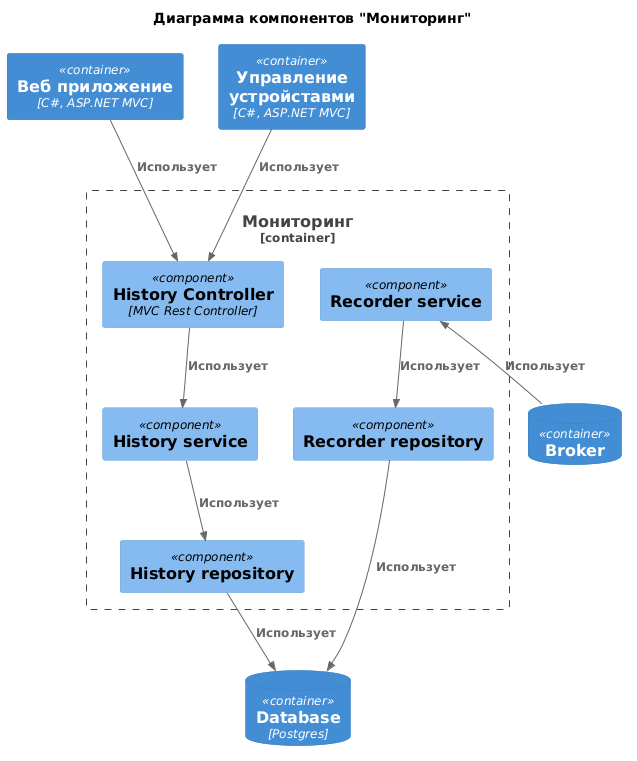
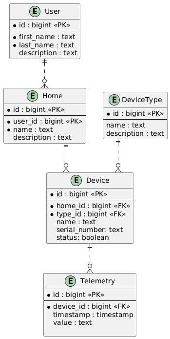

# Задание 1. Анализ и планирование

### 1. Описание функциональности монолитного приложения

**Управление отоплением:**

- Монтаж устройств отопления производится специалистами компании.
- Подключение устройств отопления к приложению "Тёплый дом" производятся специалистами компании.
- Управление отоплением осуществляется через веб-приложение "Тёплый дом" в локальной сети поселка.
- В приложение "Тёплый дом" реализовано только включение/выключение устройств отопления в своем доме.

**Мониторинг температуры:**

- Пользователи могут просматривать текущую температуру в своих домах через веб-приложение "Тёплый дом" в локальной сети поселка.

### 2. Анализ архитектуры монолитного приложения


- Язык программирования: Go
- База данных: PostgreSQL
- Архитектура: Монолитная, все компоненты системы (обработка запросов, бизнес-логика, работа с данными) находятся в рамках одного приложения.

### 3. Определение доменов и границы контекстов

Доменая модель системы "Тёплый дом"
* Домен управления устройствами
	- Bounded Context "Удаленое управления устройствами"
		- Посылает команды устройствам
	- Bounded Context "Мониторинг устройств"
		- Собирает и обрабатывает телеметрию с устройств
	- Bounded Context "Контроль доступа"
		- Добавляет и проверяет права доступа
* Домен управления пользователями

### **4. Проблемы монолитного решения**

У текущего решения существует несколько проблем 
- Взаимодействие: Синхронное, запросы обрабатываются последовательно.
- Масштабируемость: Ограничена, так как монолит сложно масштабировать по частям.
- Развертывание: Требует остановки всего приложения.

### 5. Визуализация контекста системы — диаграмма С4



# Задание 2. Проектирование микросервисной архитектуры

**Диаграмма контейнеров (Containers)**



**Диаграмма компонентов (Components)**







**Диаграмма кода (Code)**

Добавьте одну диаграмму или несколько.

# Задание 3. Разработка ER-диаграммы



# Задание 4. Создание и документирование API

### 1. Тип API

В целевом решение используется REST API для взаимодействия между клиентским приложением и системой, а так же микросервисов между собой.\
AsyncAPI используется для отправки команд и получения телеметрии с устройств.

### 2. Документация API

```yaml
asyncapi: 2.0.0
info:
  title: Device control service
  version: '1.0.0'
  description: Посылает команды устройствам

servers:
  warmhouse:
    url: mqtt://mqtt.warmhouse.ru
    protocol: mqtt
    description:  MQTT брокер системы Умный дом 

channels:
  heaterturnon/{deviceId}:
    subscribe:
      operationId: heaterTurnOn
      message:
        $ref : '#/components/messages/heaterTurnOn'

components:
  messages:
    heaterTurnOn:
      name: heaterTurnOn
      title: Команда на включение модуля отопления
      contentType: application/json
      payload:
        $ref: '#/components/schemas/heaterTurnOnPayload'

  schemas:
    heaterTurnOnPayload:
      type: object
      properties:
        command:
          type: string
          enum:
            - 'on'
            - 'off'
          description: Вкл или выкл
        sentAt:
          type: string
          format: date-time
          description: Время отправки
```

```yaml
asyncapi: 2.0.0
info:
  title: Recorder service
  version: '1.0.0'
  description: Получает телеметрию с устройств

servers:
  warmhouse:
    url: mqtt://mqtt.warmhouse.ru
    protocol: mqtt
    description:  MQTT брокер системы Умный дом 

channels:
  telematry:
    publish:
      operationId: telematry
      message:
        $ref : '#/components/messages/telemetry'

components:
  messages:
    telemetry:
      name: telemetry
      title: Телемертия
      contentType: application/json
      payload:
        $ref: '#/components/schemas/telemetryPayload'

  schemas:
    telemetryPayload:
      type: object
      properties:
        value:
          type: string
          description: Значение
        deviceId:
          type: string
          description: Идентификатор устройства
        sentAt:
          type: string
          format: date-time
          description: Время отправки
```

# Задание 5. Работа с docker и docker-compose

Перейдите в apps.

Там находится приложение-монолит для работы с датчиками температуры. В README.md описано как запустить решение.

Вам нужно:

1) сделать простое приложение temperature-api на любом удобном для вас языке программирования, которое при запросе /temperature?location= будет отдавать рандомное значение температуры.

Locations - название комнаты, sensorId - идентификатор названия комнаты

```
	// If no location is provided, use a default based on sensor ID
	if location == "" {
		switch sensorID {
		case "1":
			location = "Living Room"
		case "2":
			location = "Bedroom"
		case "3":
			location = "Kitchen"
		default:
			location = "Unknown"
		}
	}

	// If no sensor ID is provided, generate one based on location
	if sensorID == "" {
		switch location {
		case "Living Room":
			sensorID = "1"
		case "Bedroom":
			sensorID = "2"
		case "Kitchen":
			sensorID = "3"
		default:
			sensorID = "0"
		}
	}
```

2) Приложение следует упаковать в Docker и добавить в docker-compose. Порт по умолчанию должен быть 8081

3) Кроме того для smart_home приложения требуется база данных - добавьте в docker-compose файл настройки для запуска postgres с указанием скрипта инициализации ./smart_home/init.sql

Для проверки можно использовать Postman коллекцию smarthome-api.postman_collection.json и вызвать:

- Create Sensor
- Get All Sensors

Должно при каждом вызове отображаться разное значение температуры

Ревьюер будет проверять точно так же.


